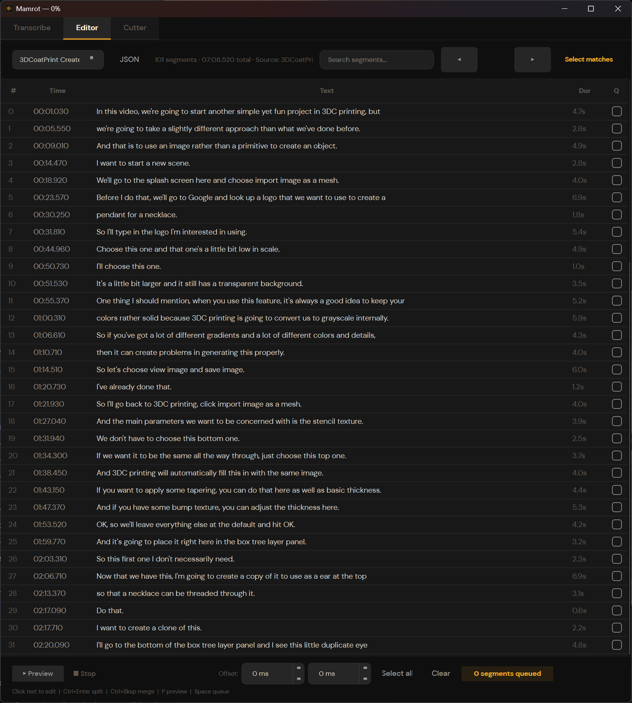

# Mamrot

Desktop audio/video transcriber & cutter.
Powered by **faster-whisper** + **ffmpeg**, wrapped in a **PySide6** (Qt6) interface.



---

## Features

- **Batch transcription** — add multiple files, transcribe all at once
- **Model selection** — tiny / base / small / medium / large-v3
- **Language** — auto-detect or pick manually (25+ languages)
- **Fragment mode** — transcribe only a time range
- **Subtitle export** — SRT, VTT, CSV, JSON
- **Transcript editor** — click any segment to edit in-place, split with Enter, merge with Ctrl+Backspace — works like a text editor, but every line has a timestamp
- **Word-level timestamps** — splits and merges snap to exact word boundaries from Whisper
- **Smart selection** — click segments to queue for cutting, select all search matches at once, contiguous ranges auto-grouped
- **Audio cutter** — selected segments → cutter queue → batch export (WAV, FLAC, MP3, OGG, AAC, Opus)
- **Audio preview** — play segment audio before cutting, with per-segment offset control
- **Padding system** — default padding + `^` markers for fine-tuning cut boundaries
- **GPU & CPU** — CUDA with float16 or CPU with int8, auto-detected

## Requirements

- Python 3.10+
- (Optional) CUDA for GPU acceleration

FFmpeg is required for audio cutting. On Windows it will be downloaded automatically on first launch. On macOS/Linux install it with your package manager:
```bash
brew install ffmpeg        # macOS
sudo apt install ffmpeg    # Ubuntu/Debian
```

## Install

```bash
git clone https://github.com/konradozog/mamrot.git
cd mamrot
python -m venv venv
venv\Scripts\activate       # Windows
# source venv/bin/activate  # macOS/Linux
pip install .
```

For GPU acceleration, install CUDA-compatible versions of `ctranslate2` and `faster-whisper` after the base install — see [faster-whisper GPU docs](https://github.com/SYSTRAN/faster-whisper#gpu).

## Run

```bash
mamrot
```

Or:
```bash
python -m mamrot
```

## First launch

On first use, select a Whisper model — it will be downloaded automatically (~500 MB for `small`). Subsequent launches use the cached model instantly.

## License

[MIT](LICENSE)
